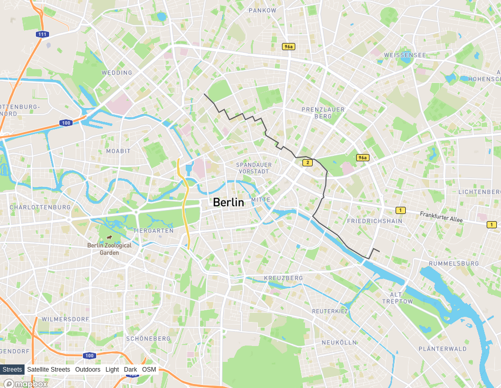

# In browser route calculation

This repo shows how it's possible to calculate the shortest path on a real city (Berlin, Germany) completely in the browser.

The memory footprint is low (40,128K according to Chrome task manager) and the speed not stellar but usable (8 seconds to parse the JSONs and generate the graph, less than 1 second for the shortest path calculation and projection).

No optimization is done, it's just uncompressed JSONs rather than Flatbuffers or similar.

## First step: load the PBF files into PostGIS
After downloading a PBF file and maybe filtering it with osmium, use `ingest_pbf.sh filename.pbf` to start a dockerized postgis instance and load it using PgOSM Flex. This will create many tables with the geometries (waterways, roads, etc.).

## Second step: generate the JSONs with the road network

Running `python3 scripts/create_graph.py` with the opportune environment variables set will generate 3 files:

* `osm_id_to_vertex_id.json` map the OSM way ID to the internal ids of the vertices (NOT to the OSM node ids)
* `vertices.json` for each internal vertex ID shows the coordinates (in EPSG:3857 by default)
* `edges.json` lists the **directed** edges between vertices

If you want, using `scripts/navigate.py` it's possible to generate a shortest path between two ways and represent it as a GeoJSON (that you can quickly inspect using geojson.io). This is for curiopsaity, and not required by the frontend

# Third step:

Use `build_frontend.sh` to build the frontend and start a server, visiting the page the necessary JSON files will be loaded into a `Graphology` instance, and the shortest path will be calculated. In the console you get a geoJSON that can be loaded in QGIS or [geojson.io](https://geojson.io).